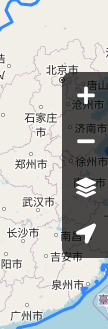
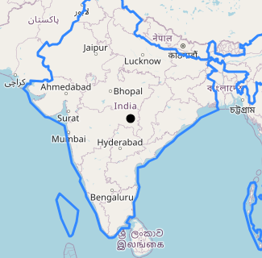
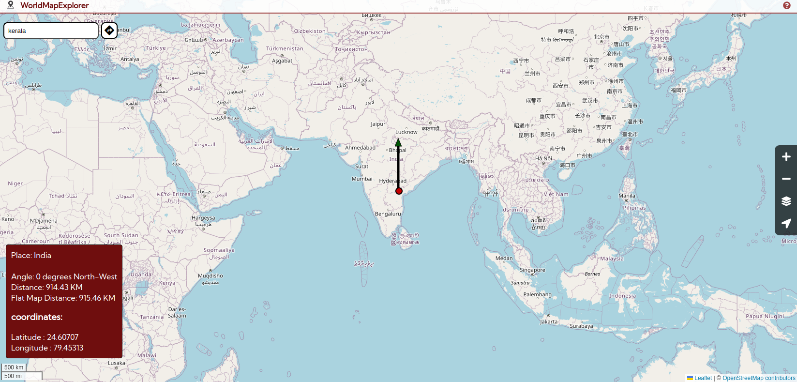
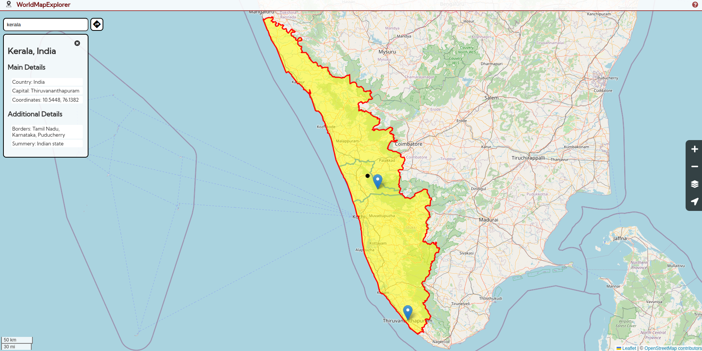
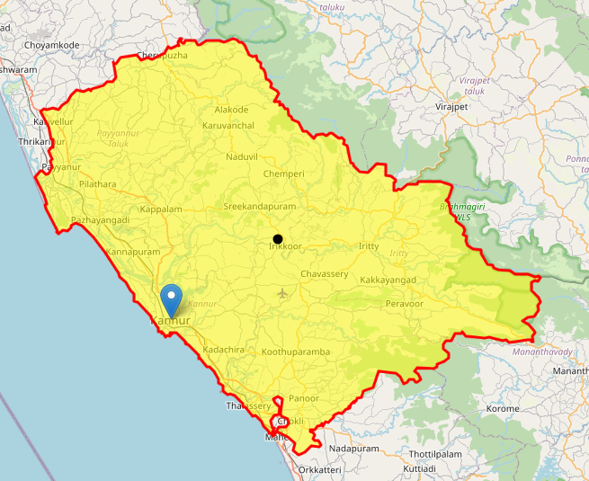

# World Map Explorer – Explore the World with Ease

Welcome to **World Map Explorer**—an inclusive and educational mapping tool designed for both visually impaired and sighted users. This manual provides an overview of the application’s key features, ensuring that you have a seamless and engaging experience while exploring the world.

## Here’s What You’ll Find Inside:
- [Map Controls](#map-controls)
- [Interactive Marker](#interactive-marker)
- [Adjustable Pointer (Adpointer)](#adjustable-pointer)
- [Search Around the World](#search-world)
- [Distance Finder](#distance-finder)
- [Inbound Navigation](#inbound-navigation)
- [Credits](#credits)

## Map Controls
Navigate the world effortlessly with our detailed map powered by **OpenStreetMap (OSM)**. The side panel offers intuitive controls to improve your experience:
- **Zoom In/Out:** Get a closer look or zoom out for a broader view.  
  **Shortcut:** Use the `+` / `-` keys.
- **Locate Me:** Instantly find your current location.  
  **Shortcut:** Press `L`.
- **Change Layers:** Switch seamlessly between geographical and political views to see the world from different perspectives.

## Interactive Marker
The Interactive Marker sets World Map Explorer apart—providing inclusivity and accessibility to everyone.

### How It Works:
The marker starts at the map’s center and is moved using the arrow keys, allowing easy exploration.

**Audio Feedback** makes navigation accessible:
- You’ll hear guiding sounds as you move the marker.
- When crossing borders, you’ll hear an alert and receive border details.
- When the marker stops, it announces the current location.

This interactive feature is fun and engaging while helping users learn about world geography!

### Handy Map Shortcuts:
- Press `Z`: Learn the scale of distance traveled by the marker with each key press (varies by zoom level and latitude).
- Shift + Arrow Key: Find out how far the border is from the current marker position.
- Press `F`: Hear the marker’s current location.
- Shift + `F`: Get the exact coordinates of the marker.
- Press `Enter`: Select the marker’s location, highlighting it and showing more details on the left.

*Note: Ensure the map is in focus when using these shortcuts. If you’re using another feature, press `Tab` to refocus.*

## Adjustable Pointer (Adpointer)
The **Adpointer** adds an innovative twist to exploring and comparing distances on the map. It’s a great way to visualize locations interactively!

### How It Works:
1. Focus on the map and press `A` to activate the Adpointer.
2. An arrow will appear from the marker’s last location. You can move the arrowhead by adjusting its angle and length.
   - Angle starts at 0 degrees (north) and rotates clockwise. For example, 90 degrees points west.

A box in the lower left shows key details:
- The place the arrowhead points to.
- The distance of the arrow.
- The direction, flat map distance*, and coordinates of the arrowhead location.

### Easy Keyboard Controls:
- Press `A` to toggle between adjusting the angle or distance.
- Press `W` to increase the selected value.
- Press `S` to decrease the selected value.
- Press the arrow keys to turn off the Adpointer and resume marker navigation.
- Press `Enter` to place the marker at the arrowhead’s position and turn off the Adpointer.
- Press `O` to hear the info box details (distance, direction, and coordinates).

*Note: Ensure the map is in focus when using these shortcuts. If you’re using another feature, press `Tab` to refocus.*

## Search Around the World
Our global search feature lets you explore any location with ease! Whether you’re looking for countries, rivers, or regions, real-time information is at your fingertips.

### How It Works:
- Type the name of a place, river, or country into the search bar.
- Detailed info such as capitals, borders, and coordinates will be displayed.
- The location is highlighted on the map for easy viewing.

*Note: Press `Esc` to quickly close and return to exploring.*

## Distance Finder
The Distance Finder helps you calculate road distances between two locations (up to 1500 km). Powered by the **Valhalla** routing engine, it provides both road distance and estimated travel time.

### How to Use:
- Click the button to find the distance, and input your starting location and destination.
- Select places from the map using the **Choose from Map** button.
- The system will display:
  - Total road distance between the two points.
  - Estimated travel time.

*Note: Press `Esc` to quickly close and return to exploring.*

## Inbound Navigation
**Inbound Navigation** adds a playful, interactive layer to map exploration!

### How It Works:
- When you search for a place and press `Enter`, two things happen:
  - The place is highlighted in the center of the map.
  - The marker moves to the center of that place.
- If the marker is within the boundary, it becomes trapped, and you can’t move it outside the border. This helps visualize borders in an engaging and interactive way!

*Note: Ensure the map is in focus when using these shortcuts. If you’re using another feature, press `Tab` to refocus. Press `Esc` to exit the boundary and continue exploring.*

